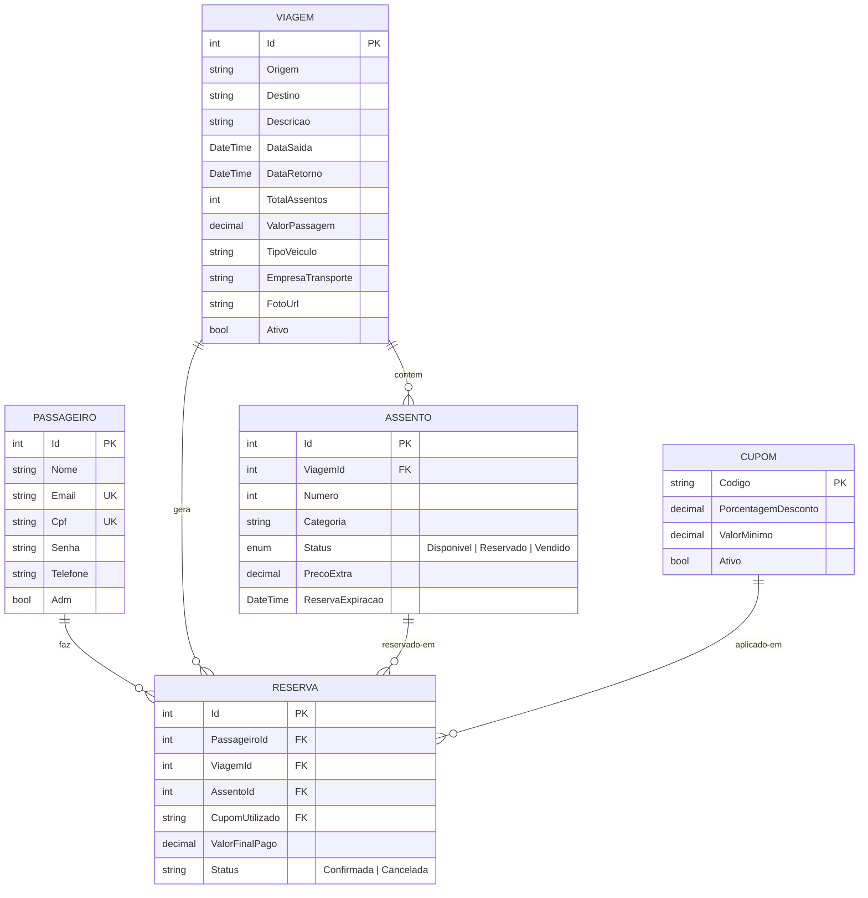

# Documento de Visão — TurismoPrime (Estado Atual)

> ✅ **PIVOTAGEM CONCLUÍDA** — Este documento descreve a visão do sistema **após** a pivotagem para TurismoPrime, já implementada.
> A pivotagem do TicketPrime (venda de ingressos para eventos) para TurismoPrime (reserva de passagens de transporte turístico) foi concluída com sucesso em 12 especificações.
> Para a documentação do estado pré-pivotagem (TicketPrime), consulte [`docs/arquitetura.md`](arquitetura.md) e [`docs/pivotagem/pivotagem.md`](pivotagem/pivotagem.md).
> Para o registro de execução da pivotagem, consulte [`docs/pivotagem/ROADMAP.md`](pivotagem/ROADMAP.md).

> **Versão:** 1.1 (Pivotagem — Implementado ✅)
> **Data:** 10/06/2026
> **Baseado no projeto original:** TicketPrime (v1.0)

---

## 0. Contexto: Estado Atual vs. Estado Pré-Pivotagem

### Estado Atual — TurismoPrime (✅ Pivotagem concluída)

O projeto encontra-se atualmente como **TurismoPrime**, uma plataforma de reserva e venda de passagens de transporte turístico. A pivotagem a partir do TicketPrime foi concluída com sucesso (todas as 12 specs implementadas).

| Aspecto | TicketPrime (Pré-Pivotagem) | TurismoPrime (Atual ✅) |
|---------|---------------------|---------------------|
| **Domínio** | Venda de ingressos para eventos | Venda de passagens de transporte turístico |
| **Entidades** | `Evento`, `Usuario`, `Cupons`, `Ingresso` | `Viagem`, `Passageiro`, `Cupom`, `Assento`, `Reserva` |
| **Autenticação** | Local (CPF + senha, sem JWT) | JWT (implementado) |
| **Persistência** | Listas em memória (`List<T>`) | Listas em memória + PostgreSQL (opcional, configurado) |
| **Mapa de assentos** | ❌ Não implementado | ✅ Mapa interativo de assentos |
| **QR Code** | ❌ Não implementado | ✅ Geração de QR Code (PngByteQRCode) |
| **Fluxo de compra** | Carrinho simples, sem checkout real | Reserva temporária (15 min) + checkout |

A pivotagem (descrita em [`docs/pivotagem/`](pivotagem/)) consistiu em renomear entidades (`Evento` → `Viagem`, `Usuario` → `Passageiro`, `Ingresso` → `Passagem`) e adicionar novos módulos (mapa de assentos, QR Code, JWT, banco de dados), seguindo as 12 specs do [`ROADMAP.md`](pivotagem/ROADMAP.md).

As seções abaixo descrevem a **visão implementada** (TurismoPrime).

## 1. Introdução

### 1.1. Propósito

O **TurismoPrime** é uma plataforma web para reserva e venda de passagens de transporte turístico. O sistema permite que passageiros visualizem viagens disponíveis, selecionem assentos numerados em um mapa interativo do ônibus, realizem reservas temporárias e comprem passagens com geração de QR Code para embarque. Administradores podem cadastrar viagens, gerenciar frotas e controlar a disponibilidade de assentos.

Este documento descreve a visão geral do produto, seus stakeholders, funcionalidades e restrições, servindo como guia de alinhamento para toda a equipe de desenvolvimento.

### 1.2. Escopo

O TurismoPrime abrange:

- **Catálogo de viagens** — listagem, busca e filtro de viagens turísticas disponíveis
- **Detalhes da viagem** — informações de origem, destino, data, tipo de veículo e preço
- **Mapa de assentos interativo** — seleção visual de assentos numerados no ônibus
- **Autenticação** — login com JWT para passageiros e administradores
- **Carrinho e checkout** — fluxo de compra com reserva temporária de 15 minutos
- **Geração de passagem** — emissão de passagem com QR Code para embarque
- **Área do passageiro** — visualização de passagens compradas e histórico
- **Painel administrativo** — cadastro e gerenciamento de viagens, assentos e cupons
- **Cupons de desconto** — aplicação de descontos sobre o valor da passagem

### 1.3. Definições, Acrônimos e Abreviações

| Termo | Definição |
|-------|-----------|
| **API** | Backend ASP.NET Core Minimal API que expõe endpoints REST |
| **Assento** | Unidade de venda individual dentro de uma viagem |
| **Blazor** | Framework web da Microsoft para componentes interativos em C# |
| **CORS** | Cross-Origin Resource Sharing — política de segurança do navegador |
| **JWT** | JSON Web Token — padrão de autenticação stateless |
| **Mapa de Assentos** | Componente visual que exibe o layout do ônibus com assentos |
| **Passageiro** | Usuário cadastrado na plataforma (antigo "Usuario") |
| **Passagem** | Comprovante de compra de um assento em uma viagem (antigo "Ingresso") |
| **QR Code** | Código bidimensional para validação rápida da passagem no embarque |
| **Reserva Temporária** | Bloqueio de assento por 15 minutos durante o checkout |
| **Viagem** | Roteiro turístico com origem, destino, data e veículo (antigo "Evento") |
| **WASM** | WebAssembly — permite executar código C# no navegador |

---

## 2. Problema

### 2.1. Problema

O mercado de transporte turístico regional no Brasil ainda é pouco digitalizado. Agências de turismo e transportadoras operam majoritariamente com reservas por telefone, WhatsApp ou presencialmente, sem oferecer ao passageiro a experiência de selecionar visualmente seu assento, comparar opções de veículos (leito, semileito, convencional) ou receber uma passagem digital com QR Code.

| O problema de | Passageiros que desejam reservar transporte turístico |
|---------------|------------------------------------------------------|
| **Afeta** | Viajantes, turistas, grupos organizados |
| **Cujo impacto é** | Dificuldade em comparar opções, falta de transparência na disponibilidade de assentos, impossibilidade de escolher o assento desejado, processo manual de reserva |
| **Uma solução bem-sucedida seria** | Uma plataforma web com catálogo de viagens, mapa interativo de assentos, reserva temporária, pagamento online e passagem digital com QR Code |

### 2.2. Usuários Afetados

| Perfil | Descrição | Necessidades |
|--------|-----------|-------------|
| **Visitante** | Pessoa que acessa o site sem estar logada | Visualizar catálogo de viagens, pesquisar destinos |
| **Passageiro** | Usuário cadastrado e logado | Comprar passagem, escolher assento, visualizar passagens adquiridas, fazer check-in |
| **Administrador** | Gestor da plataforma (transportadora) | Cadastrar viagens, gerenciar veículos, controlar cupons, validar passagens |

---

## 3. Stakeholders

| Stakeholder | Interesse |
|-------------|-----------|
| **Equipe de desenvolvimento** (6 alunos) | Implementar todas as funcionalidades dentro do prazo acadêmico, seguindo boas práticas de Engenharia de Software |
| **Professor avaliador (UNIFESO)** | Avaliar a aplicação dos conceitos de ES: documentação, arquitetura, testes, rastreabilidade |
| **Transportadoras parceiras** *(futuro)* | Oferecer seus roteiros na plataforma em troca de visibilidade |
| **Passageiros** | Usar a plataforma para reservar transporte turístico de forma rápida e confiável |

---

## 4. Visão Geral do Produto

### 4.1. Perspectiva do Produto

O TurismoPrime é um **sistema novo**, construído a partir da pivotagem do TicketPrime (venda de ingressos). Ele se posiciona como uma alternativa digital moderna para o mercado de transporte turístico regional.

A arquitetura de **eventos com assentos** do TicketPrime mapeia quase perfeitamente para **viagens com assentos de ônibus**, permitindo reaproveitar aproximadamente 80% do código existente. A pivotagem consiste principalmente em renomeação de entidades (`Evento` → `Viagem`, `Usuario` → `Passageiro`, `Ingresso` → `Passagem`) e adição do módulo de mapa de assentos.

### 4.2. Diagrama de Contexto do Sistema

```
┌─────────────────────────────────────────────────────────────────┐
│                       TURISMOPRIME                              │
│                                                                 │
│  ┌──────────────────────┐       ┌──────────────────────────┐    │
│  │                      │       │                          │    │
│  │   FRONTEND (Blazor)  │ HTTP  │   BACKEND (Minimal API)  │    │
│  │   localhost:5096     │◄─────►│   localhost:5289         │    │
│  │                      │       │                          │    │
│  │  ┌────────────────┐  │       │  ┌────────────────────┐  │    │
│  │  │ Server Mode    │  │       │  │ ViagensController  │  │    │
│  │  │ (renderização) │  │       │  │ PassageirosControl │  │    │
│  │  ├────────────────┤  │       │  │ AssentosController │  │    │
│  │  │ WASM Mode      │  │       │  │ CuponsController   │  │    │
│  │  │ (interativo)   │  │       │  │ Auth (JWT)         │  │    │
│  │  └────────────────┘  │       │  └────────────────────┘  │    │
│  │                      │       │                          │    │
│  └──────────────────────┘       └──────────────────────────┘    │
│                                          │                      │
│                                          ▼                      │
│                                 ┌──────────────────┐            │
│                                 │   PostgreSQL     │            │
│                                 │  (Opcional)      │            │
│                                 └──────────────────┘            │
└─────────────────────────────────────────────────────────────────┘
```

### 4.3. Pressuposições e Dependências

| Pressuposto | Detalhes |
|-------------|----------|
| **.NET 10 SDK instalado** | Único pré-requisito obrigatório para build e execução |
| **Navegador moderno** | O frontend Blazor funciona em Chrome, Edge, Firefox e Safari (versões atuais) |
| **Conexão de rede local** | API e Frontend rodam no mesmo computador (localhost) |
| **Banco de dados opcional** | O sistema funciona com listas em memória; PostgreSQL é opcional (SP-09) |
| **Sistema operacional Windows** | O `System.Drawing.Common` usado pelo QRCoder tem suporte completo no Windows |
| **Sem deploy em produção** | O sistema é acadêmico, sem necessidade de hospedagem em nuvem |

---

## 5. Funcionalidades do Produto

### 5.1. Funcionalidades por Perfil

#### Visitante (não logado)

| ID | Funcionalidade | Prioridade | Descrição |
|----|---------------|-----------|-----------|
| F01 | Visualizar catálogo de viagens | Essencial | Lista de viagens disponíveis com destino, data, preço e imagem |
| F02 | Pesquisar viagens | Essencial | Campo de busca por destino, origem ou descrição |
| F03 | Filtrar viagens | Desejável | Filtros por data, tipo de veículo, faixa de preço |
| F04 | Ver detalhes da viagem | Essencial | Página com informações completas (origem, destino, data, veículo, preço) |
| F05 | Criar conta | Essencial | Formulário de cadastro com nome, email, CPF e senha |
| F06 | Realizar login | Essencial | Autenticação com email e senha |

#### Passageiro (logado)

| ID | Funcionalidade | Prioridade | Descrição |
|----|---------------|-----------|-----------|
| F07 | Selecionar assento no mapa visual | Essencial | Mapa interativo do ônibus com assentos coloridos (verde=disp, amarelo=reserv, vermelho=vend) |
| F08 | Adicionar passagem ao carrinho | Essencial | Seleciona assento e adiciona ao carrinho de compras |
| F09 | Aplicar cupom de desconto | Essencial | Campo para inserir cupom com validação e atualização automática do valor |
| F10 | Finalizar compra (checkout) | Essencial | Fluxo de pagamento com reserva temporária de 15 minutos |
| F11 | Visualizar minhas passagens | Essencial | Lista de passagens compradas com detalhes e QR Code |
| F12 | Visualizar QR Code da passagem | Essencial | Código QR para validação no embarque |
| F13 | Reservar assento temporariamente | Essencial | Assento fica reservado por 15 min durante o checkout |
| F14 | Cancelar passagem | Desejável | Cancelamento com reembolso parcial (até 24h antes) |
| F15 | Fazer check-in | Desejável | Check-in até 30 minutos antes da partida |

#### Administrador

| ID | Funcionalidade | Prioridade | Descrição |
|----|---------------|-----------|-----------|
| F16 | Cadastrar nova viagem | Essencial | Formulário com origem, destino, data, veículo, preço |
| F17 | Gerenciar viagens | Essencial | Listar, editar, cancelar viagens cadastradas |
| F18 | Gerenciar cupons de desconto | Essencial | Cadastrar, ativar/desativar cupons |
| F19 | Visualizar passagens vendidas | Essencial | Relatório de passagens vendidas por viagem |
| F20 | Validar passagem no embarque | Desejável | Leitura de QR Code para confirmar embarque |
| F21 | Definir limite de assentos | Essencial | Capacidade do veículo (40, 46 ou 50 assentos) |

### 5.2. Mapeamento Histórias de Usuário Originais → TurismoPrime

As 24 histórias de usuário originais do TicketPrime (em [`historiasdeusuario.md`](historiasdeusuario.md)) foram adaptadas para o domínio de turismo:

| ID Original | História (adaptada para TurismoPrime) |
|-------------|--------------------------------------|
| 01 | Como visitante, quero visualizar **viagens** sem fazer login |
| 02 | Como visitante, quero criar uma conta como **passageiro** |
| 03 | Como **passageiro**, quero realizar login |
| 04 | Como **passageiro**, quero recuperar minha senha |
| 05 | Como usuário, quero pesquisar **viagens por destino** |
| 06 | Como usuário, quero filtrar viagens por **data, tipo de veículo ou destino** |
| 07 | Como usuário, quero acessar detalhes da **viagem** (origem, destino, data, preço) |
| 08 | Como usuário, quero compartilhar **viagens** |
| 09 | Como usuário, quero adicionar **passagens** ao carrinho |
| 10 | Como **passageiro**, quero finalizar a compra da **passagem** |
| 11 | Como **passageiro**, quero receber a **passagem** com QR Code por e-mail |
| 12 | Como **passageiro**, quero visualizar minhas **passagens** adquiridas |
| 13 | Como **passageiro**, o sistema deve limitar uma **passagem por CPF por viagem** |
| 14 | Como usuário, quero acessar uma aba de **viagens disponíveis** |
| 15 | Como usuário, quero interface responsiva com cards de **viagem** |
| 16 | Como **passageiro**, quero usar cupons de desconto no checkout |
| 17 | Como **passageiro**, quero **reservar assento** em viagens futuras |
| 18 | Como administrador, quero criar novas **viagens** |
| 19 | Como administrador, quero visualizar todas as **viagens** criadas |
| 20 | Como administrador, quero gerenciar **lotes de assentos e preços** |
| 21 | Como administrador, quero **cancelar viagens** |
| 22 | Como administrador, quero definir **limite de assentos por viagem** |
| 23 | Como administrador, quero limitar **um cupom por passagem** |
| 24 | Como administrador, quero visualizar **passagens vendidas** |

---

## 6. Funcionalidades Fora de Escopo

| Funcionalidade | Motivo da Exclusão |
|----------------|-------------------|
| Pagamento real (gateway) | Escopo acadêmico — simulado |
| Notificações push | Sem infraestrutura de notificações |
| Aplicativo mobile nativo | Blazor Web App é responsivo e cobre mobile via navegador |
| Integração com redes sociais | Fora do escopo da disciplina |
| Chat em tempo real | Complexidade não justificada para MVP |
| Multilíngue | Português apenas (público-alvo nacional) |
| Aluguel de ônibus inteiro | Pode ser adicionado em versão futura |

---

## 7. Modelo de Dados (Domínio)

### 7.1. Entidades Principais



### 7.2. Estados do Assento

```
                    ┌──────────────┐
                    │  Disponivel  │
                    └──────┬───────┘
                           │
                    Usuário seleciona
                           │
                           ▼
                    ┌──────────────┐
                    │  Reservado   │◄──── 15 min ────┐
                    │  (temporário)│                  │
                    └──────┬───────┘                  │
                           │                          │
                  ┌────────┴────────┐                 │
                  │                 │                 │
                  ▼                 ▼                 │
           ┌────────────┐  ┌──────────────┐           │
           │  Vendido   │  │ Checkout não │───────────┘
           │  (pago)    │  │ finalizado   │
           └────────────┘  └──────────────┘
```

---

## 8. Restrições Técnicas

| Restrição | Detalhe |
|-----------|---------|
| **Plataforma** | Web (não mobile nativo) |
| **Framework frontend** | Blazor Web App (Server + WASM interativo) |
| **Framework backend** | ASP.NET Core 10 Minimal API |
| **Linguagem** | C# 13 |
| **Banco de dados** | Listas em memória (padrão); PostgreSQL + Dapper (opcional) |
| **Autenticação** | JWT sem ASP.NET Core Identity |
| **QR Code** | QRCoder 1.6.0 + System.Drawing.Common 9.0.4 |
| **Portas** | API: 5289, Frontend: 5096 |
| **Testes** | xUnit + coverlet |
| **IDE** | Visual Studio 2022 ou VS Code |

---

## 9. Atributos de Qualidade

| Atributo | Estratégia |
|----------|------------|
| **Disponibilidade** | Sistema local (single-user); disponibilidade = 100% enquanto a máquina do desenvolvedor estiver ligada |
| **Performance** | Listas em memória garantem resposta < 10ms para operações CRUD. QR Code gerado em < 500ms |
| **Segurança** | JWT com chave simétrica para autenticação; CORS restrito a `http://localhost:5096`; senhas armazenadas com hash |
| **Manutenibilidade** | Código organizado por domínio (pastas `viagens/`, `passageiros/`, `assentos/`, `cupons/`); documentação no formato ADR |
| **Testabilidade** | xUnit com testes unitários para regras de negócio; cada spec do ROADMAP inclui comando de build para validação contínua |
| **Usabilidade** | Interface responsiva com Bootstrap 5; mapa de assentos com código de cores intuitivo (verde/amarelo/vermelho) |

---

## 10. Marcos e Cronograma (Executado)

> ✅ A pivotagem foi concluída conforme o planejamento abaixo. Todas as 12 specs foram implementadas com sucesso.

| Marco | Specs | Previsão (Planejado) | Descrição | Status |
|-------|-------|----------|-----------|--------|
| M1 — Renomeação | SP-01, SP-02 | Dia 1-2 | API e Frontend renomeados para domínio de turismo | ✅ |
| M2 — Assentos | SP-03, SP-04, SP-05 | Dia 3-5 | Modelo de assentos, endpoints e mapa visual implementados | ✅ |
| M3 — Fluxo de Compra | SP-06, SP-07 | Dia 6-7 | Reserva temporária, checkout, QR Code | ✅ |
| M4 — Autenticação | SP-08 | Dia 8-9 | JWT implementado e endpoints protegidos | ✅ |
| M5 — Banco + Testes | SP-09, SP-10 | Dia 10-11 | Integração com PostgreSQL e testes (14 testes passando) | ✅ |
| M6 — Finalização | SP-11, SP-12 | Dia 12 | Assets visuais e documentação atualizados | ✅ |

---

## 11. Referências

- [`docs/pivotagem/ROADMAP.md`](pivotagem/ROADMAP.md) — Registro de execução das 12 specs (todas concluídas ✅)
- [`docs/arquitetura.md`](arquitetura.md) — Arquitetura do sistema (pré-pivotagem TicketPrime)
- [`docs/pivotagem/ADR-001-pivotagem-turismo.md`](pivotagem/ADR-001-pivotagem-turismo.md) — Decisão arquitetural da pivotagem
- [`docs/pivotagem/pivotagem.md`](pivotagem/pivotagem.md) — Plano conceitual da pivotagem
- [`docs/historiasdeusuario.md`](historiasdeusuario.md) — Histórias de usuário (24 adaptadas para TurismoPrime)
- [`CORRECAO.md`](../CORRECAO.md) — Correção da avaliação AV1
- [`README.md`](../README.md) — Documentação atual do TurismoPrime
- IEEE 830-1998 — Recommended Practice for Software Requirements Specifications
